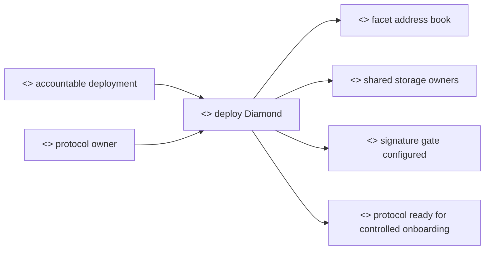
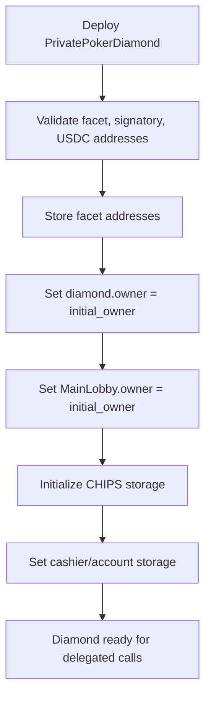
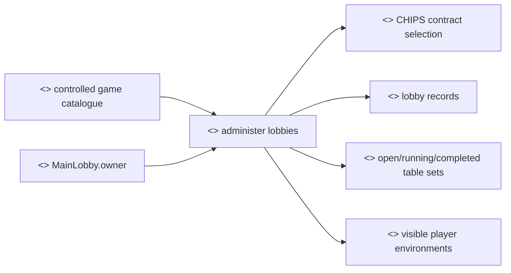
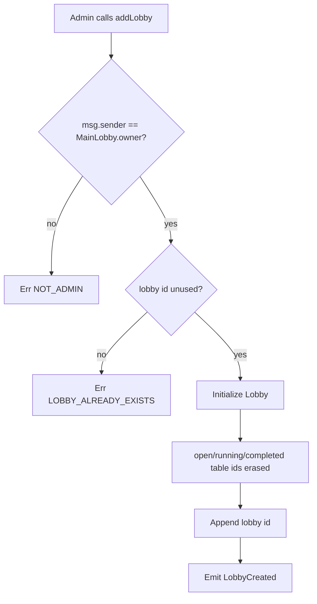
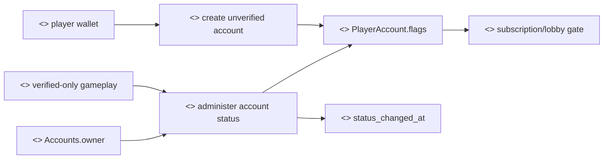
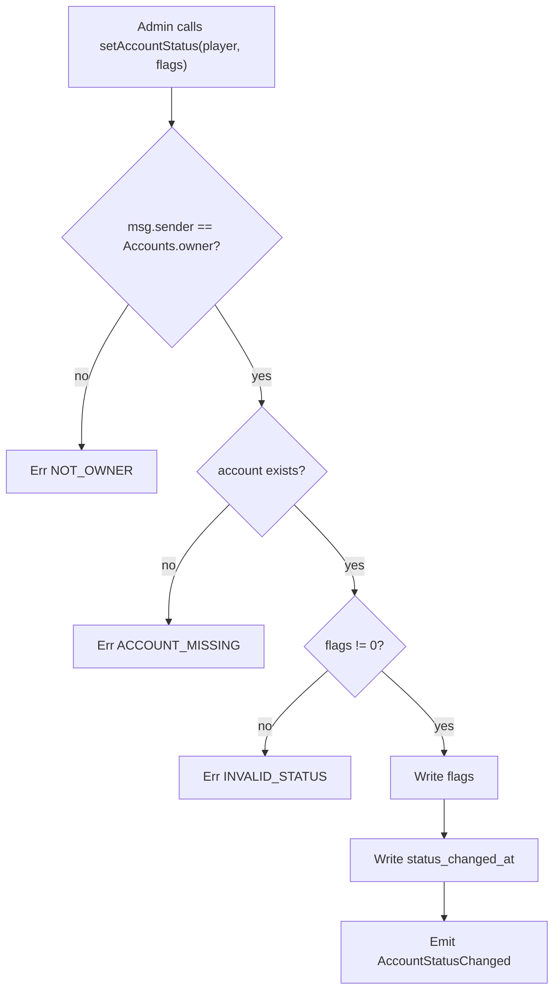
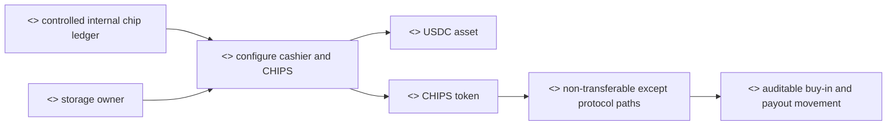
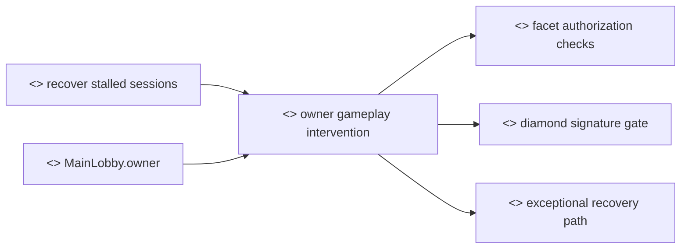
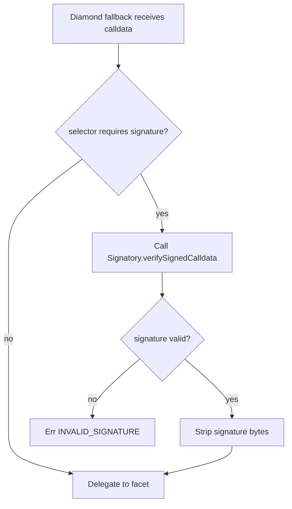

# Admin Security Flows

## 1. Purpose

This document describes the smart-contract flows controlled by the protocol owner. In this codebase, admin authority is the address stored as `owner` in the relevant storage module. For the diamond deployment path, the constructor writes the same `initial_owner` into the diamond, main lobby, cashier, chips, and account storage areas.

The admin role exists to configure the protocol, create and remove lobbies, manage KYC account status, and perform owner-only token setup. Normal gameplay is still expected to run through player and operator flows.

### 1.1 Engagement Goal

For an Innovation Hub discussion, the admin security case should show which powers remain centralized, why those powers exist, and what governance or operational controls would be needed before launch. The goal is to invite feedback on owner-key custody, change management, KYC status governance, emergency response, audit trails, and separation of duties.

### 1.2 Why This Security Case Matters

The admin role is the strongest trust assumption in the current contracts. It exists because early-stage systems need controlled setup, account-status administration, token configuration, and recovery paths. The same power also creates risk: an owner key can affect access, lobbies, and configuration. This document therefore makes admin authority explicit so it can be reduced, governed, monitored, or transferred to a stronger governance model later.

## 2. Actors And Storage Owners

| Actor | Meaning | Primary storage |
| --- | --- | --- |
| Diamond owner | Deployment owner recorded by `PrivatePokerDiamond` | `PrivatePokerDiamond.owner` |
| Main lobby owner | Owner used by lobby/table/hand/settler authorization | `MainLobby.owner` |
| Accounts owner | Owner used by account setup and KYC status | `PrivatePokerAccountsStorage.owner` |
| Cashier owner | Owner used by cashier token configuration | `PrivatePokerCashierStorage.owner` |
| Chips owner | ERC20 owner used by chips admin methods | `PrivatePokerChipsStorage.token.owner` |

## 3. Deployment Procedure

### 3.1 Rationale

Deployment establishes the trust root of the protocol. The rationale is to make the top-level poker operator contract, the owner addresses, the facet addresses, and the token dependencies explicit before any player can interact with the system.

We provide the following operations:

- Deploying the Diamond as the top-level poker operator contract. The Diamond is the contract users normally call. It routes business operations to owned facets and holds the shared storage context used by lobbies, accounts, cashier, chips, and gameplay settlement.
- Setting one initial owner across owned storage areas. This gives a single accountable administrative identity during the prototype phase and creates a clear starting point for later governance, multisig, or DAO migration.
- Registering facet contracts and signature-verification dependencies. This defines which code is allowed to execute behind the Diamond and which calls require signed-calldata checks.
- Binding the USDC-like asset and CHIPS accounting path. This ensures subscription and cashier flows have a configured asset before value-bearing operations are enabled.

### 3.2 Methods

- `constructor(address initial_owner, address lobby_facet, address table_facet, address hand_facet, address aggregate_pub_key_facet, address settler_facet, address spectate_facet, address account_facet, address cashier_facet, address chips_facet, address signatory, address usdc)`

### 3.3 Procedure

The canonical deployment path is `PrivatePokerDiamond::constructor(initial_owner, facets..., signatory, usdc)`.

The constructor:

- records all facet addresses in `PrivatePokerDiamond`;
- sets `PrivatePokerDiamond.owner` to `initial_owner`;
- sets `MainLobby.owner` to `initial_owner`;
- sets `MainLobby.chip_token` to the diamond contract address;
- initializes CHIPS metadata and owner;
- permits the diamond address as cashier, lobby, and account in CHIPS storage;
- configures cashier storage with `usdc` and CHIPS equal to the diamond address;
- configures accounts storage with `usdc`, CHIPS, cashier, and owner.

## 4. Lobby Administration

### 4.1 Rationale

Lobby administration defines which poker environments are visible to players. A lobby is a logical grouping of poker tables. It is not the same thing as a poker variant: it can represent a venue, product segment, jurisdiction, partner organisation, future DAO-managed area, or restricted community.

We provide the following operations:

- Defining the contract to be used as CHIPS in the game. This contract must guarantee that CHIPS are soul-bound in ordinary user flows, while still allowing the top-level poker operator contract, the Diamond, to move CHIPS into and out of tables for buy-ins and winner payouts.
- Creating new lobbies so games can be grouped into logical categories. A future lobby could be public, restricted to members of an organisation, restricted by badge or credential, or configured for a specific business owner. The owner controls lobby creation so the public product surface remains deliberate.
- Removing lobbies as a purely administrative option. In ordinary operation lobbies should not be removed casually, because removal affects table visibility and historical context. Removal exists for exceptional reasons such as test cleanup, bad configuration, legal or compliance intervention, or product retirement.

### 4.2 Methods

- `setChipToken(address chip_token)`
- `addLobby(uint256 id, uint256 game_type, uint256 flags, string name)`
- `removeLobby(uint256 id)`

These selectors route through the diamond fallback to the lobby facet.

### 4.3 Authorization

Each lobby admin method checks `msg.sender == MainLobby.owner`.

### 4.4 Storage Effects

`setChipToken` writes `MainLobby.chip_token`.

`addLobby` creates the lobby record, erases table-id vectors, writes lobby metadata, initializes counters, and appends the lobby id to `MainLobby.lobby_ids`.

`removeLobby` removes the lobby id by swap-removing it from `MainLobby.lobby_ids`, clears all open, running, and completed table records, erases lobby metadata, and erases all three table-id collections.

## 5. Account And KYC Administration

### 5.1 Rationale

Account and KYC administration is the main eligibility control. A wallet address alone is not enough to enter value-bearing gameplay. The account status model creates a controlled step between a player proving wallet control and a player being allowed to subscribe, buy in, or enter the main lobby.

We provide the following operations:

- Creating an account in an unverified state. This lets the player begin onboarding without granting access to gameplay, and gives the operator a record to review.
- Changing account status after review. Verification, suspension, banning, and deletion are owner-controlled so KYC, sanctions screening, jurisdiction rules, responsible-gaming controls, and conduct decisions can be enforced centrally during the prototype phase.
- Recording the time of the last status change. This supports operational audit, customer-support review, and later compliance reporting.
- Configuring account token dependencies. Account storage needs to know the USDC, CHIPS, and cashier addresses so subscription and minting logic are tied to the intended protocol contracts.
- Reading account and status data. Read methods allow the frontend, operators, and auditors to distinguish unverified, verified, suspended, banned, deleted, and missing accounts.

### 5.2 Methods

- `createAccount(address player_address)`
- `setAccountStatus(address player_address, uint256 flags)`
- `setTokens(address usdc, address chips, address cashier)`
- read methods: `getAccountStatus`, `accountStatusChangedAt`, `getAccount`, `accountCount`, `accountAt`

### 5.3 Authorization

`setAccountStatus` and account `setTokens` require `msg.sender == PrivatePokerAccountsStorage.owner`.

`createAccount` may be called by either the account player for their own address or by the accounts owner.

### 5.4 Status Model

Account existence is represented by non-zero `PlayerAccount.flags`. A zero flags value means the account entry does not exist.

Defined status bits:

| Status | Value |
| --- | ---: |
| Unverified | `1` |
| Verified | `2` |
| Suspended | `4` |
| Banned | `8` |
| Deleted | `16` |

`setAccountStatus` also updates `status_changed_at` to the current block timestamp.

## 6. Cashier And Chips Administration

### 6.1 Rationale

Cashier and CHIPS administration defines how value enters, moves inside, and exits the poker system. The rationale is to keep payment accounting and game chips separate but linked through explicit owner-controlled configuration.

We provide the following operations:

- Defining the asset and share contracts used by the cashier. The asset is the USDC-like token; the share side is represented by CHIPS in the poker system.
- Defining which contracts are allowed to act as cashier, lobby, and account authorities for CHIPS. This prevents ordinary users from freely transferring CHIPS outside protocol-approved paths.
- Minting and burning CHIPS only through controlled protocol authority. This supports subscription credits, redemption design, and future reconciliation.
- Restricting ordinary CHIPS transferability. CHIPS should behave like poker chips inside the product, not like a freely transferable payment token.

### 6.2 Methods

- Cashier configuration: `setTokens(address usdc, address chips)`
- CHIPS authority configuration: `setCashier(address cashier)`, `setLobby(address lobby)`, `setAccount(address account)`
- CHIPS supply operations: `mint(address to, uint256 value)`, `burn(address from, uint256 value)`

### 6.3 Cashier

`Cashier::setTokens(address usdc, address chips)` requires `msg.sender == PrivatePokerCashierStorage.owner`.

The cashier uses 1:1 asset/share conversion. `depositFrom` is restricted to calls where `msg.sender == address(this)`, which is the diamond address in delegated execution.

### 6.4 Chips

Owner-only CHIPS setup methods:

- `setCashier(address cashier)`
- `setLobby(address lobby)`
- `setAccount(address account)`

CHIPS `mint` and `burn` are diamond-only. CHIPS transfers are restricted to protocol movements: player or operator to diamond, diamond buy-in pulls, diamond payouts, and owner transfers.

## 7. Admin Participation In Gameplay

### 7.1 Rationale

Admin participation in gameplay is an operational recovery path, not the normal user journey. The rationale is to preserve a way to recover from broken prototype sessions while making that extraordinary authority visible for governance review.

We provide the following operations:

- Allowing the owner to perform selected gameplay operations where an operator would normally act. This can help recover a table when a client or operator is unavailable.
- Keeping signed-calldata gates for protected aggregate-key and settlement operations. Owner authority does not remove the need for signature-gated calls where the Diamond enforces them.
- Documenting owner bypasses explicitly. This makes it easier to decide later whether the bypass should remain, require multisig, produce stronger logs, or be removed.

### 7.2 Methods

Some gameplay methods include an owner bypass for operational recovery:

- `createTable` and `joinTable`: `msg.sender` may be the table player's operator or `MainLobby.owner`.
- `startHand`: `MainLobby.owner` may mark readiness for seat `0`.
- `setTableAggregatePublicKey` and `settleHand`: `msg.sender` may be `MainLobby.owner` or one of the table operators.

For signed diamond calls, the signature gate is applied before delegated execution for aggregate public key and settlement selectors.

## 8. Expected Outcomes

Successful admin flows leave the system in one of these states:

- facets and shared storage are initialized by the diamond constructor;
- lobbies are added, removed, or configured;
- player accounts are created or assigned status flags;
- token and cashier contract references are configured;
- protocol ownership checks continue to use stored owner values rather than hard-coded addresses.

## 9. Failure States

Common expected failures:

- `NOT_ADMIN` when a non-lobby-owner calls lobby admin methods;
- `NOT_OWNER` when a non-owner calls account, cashier, or chips owner methods;
- `ACCOUNT_MISSING` when status is changed for a missing account;
- `INVALID_STATUS` when an admin attempts to set zero account flags;
- `LOBBY_ALREADY_EXISTS`, `LOBBY_NOT_FOUND`, or `TABLE_NOT_FOUND` for invalid lobby/table state;
- `FACET_NOT_INSTALLED` or selector errors when diamond routing cannot resolve a target facet.

## 10. Security Considerations

The owner concept is storage-specific. In normal diamond deployment those owner fields are initialized to the same address, but they are still separate storage values.

The diamond has constructor-time facet registration and read accessors for facet addresses. No facet-upgrade entry point is exposed in the current public surface.

Completed tables are retained in `completed_table_ids` and excluded from active table listing, but table detail remains readable by id while the table storage record exists.

Swap-removal is intentionally used when removing ids from vectors. Consumers must not rely on stable ordering for lobby ids or table ids after removal or table state transitions.

## 11. Implementation Reference

- `contracts/diamond/src/privatepoker_diamond.rs`
- `contracts/lobby/src/privatepoker_lobby.rs`
- `contracts/account/src/account.rs`
- `contracts/cashier/src/cashier.rs`
- `contracts/chips/src/chips.rs`
- `common/src/model/lobby.rs`
- `common/src/model/accounts.rs`
- `common/src/model/diamond.rs`
