# Operator Security Flows

## 1. Purpose

This document describes smart-contract flows performed by an operator address. The operator is the gameplay caller associated with a player account through subscription. Most table and hand operations require `msg.sender` to be either a stored table operator or `MainLobby.owner`.

The operator role is responsible for creating and joining tables on behalf of a player, starting hands, submitting aggregate public keys, and settling hands.

### 1.1 Engagement Goal

For an Innovation Hub discussion, the operator security case should show why gameplay execution is delegated away from the player wallet, how that delegation is constrained, and which abuse scenarios must be controlled. The goal is to obtain feedback on key management, user consent, revocation, transaction monitoring, and whether operator-based automation is acceptable for the intended user journey.

### 1.2 Why This Security Case Matters

The operator is a convenience and safety mechanism, but it is also a delegated authority. It allows gameplay transactions to proceed without forcing the player to manually approve every low-level action, which improves usability during a fast poker session. The risk is that a compromised or incorrectly associated operator could act for the wrong player. This is why the contracts associate an operator only through subscription and then check operator authority on gameplay calls.

## 2. Actors And Prerequisites

| Actor | Meaning |
| --- | --- |
| Operator | Address stored in `PlayerAccount.operator` and later in `TablePlayer.operator` |
| Player | Account address associated with the operator |
| Main lobby owner | Recovery/admin caller accepted by gameplay methods |
| Diamond | Delegates calls to facets and verifies signed calldata for protected selectors |
| Signatory | External verifier called by the diamond before protected delegate calls |

Prerequisites:

- the player account exists and is `Verified`;
- `subscribe` has associated the operator with the player;
- the player has enough CHIPS and diamond allowance for buy-ins;
- table methods are called through the diamond in normal operation;
- aggregate public key and settlement calls include the appended BLS signature bytes expected by the diamond.

## 3. Operator Association

### 3.1 Rationale

Operator association defines who can perform gameplay transactions for a player. The rationale is to keep the player as the account and economic identity while allowing a separate operator address to execute frequent gameplay calls.

We provide the following operations:

- Associating an operator with a verified player during subscription. This avoids passing arbitrary operator addresses into every table method and makes the relationship traceable from account storage.
- Mapping the operator back to the player. This lets token and gameplay contracts treat operator calls as actions for the associated player where the rules allow it.
- Keeping association out of ordinary table operations. Table creation and joining read the existing account association instead of creating a new one.

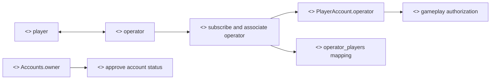

### 3.2 Methods

- `subscribe(address player_address, address operator, bytes annonce_public_key, bytes encrypted_profile, uint8 subscription_tier)`

The operator is associated by `subscribe`. No other flow should write this association.

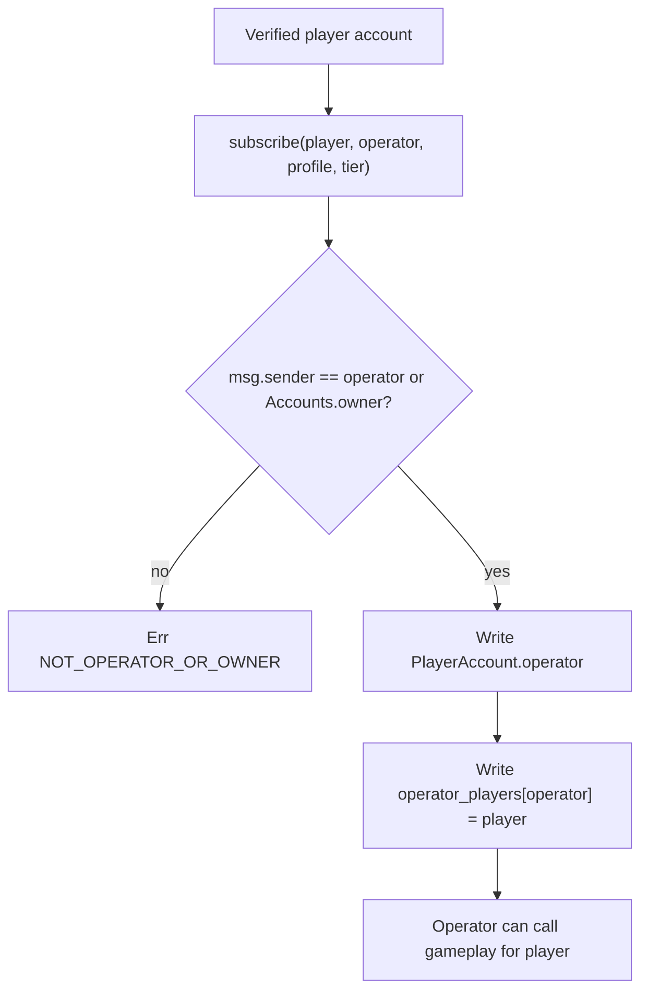

## 4. Create Table

### 4.1 Rationale

Create Table is the operator flow that turns a verified, subscribed player into the first seated participant of a value-bearing table. The rationale is to make sure table creation is not only a UI action: it is an auditable operation that checks operator authority, collects CHIPS, creates a table record, and publishes it into the lobby as open.

We provide the following operations:

- Creating a new table for the associated player. The operator must already be tied to the player account, and the table stores both the player and the operator.
- Collecting the player's CHIPS buy-in into the protocol-controlled table path. This confirms the player has committed value before the table is listed.
- Recording the table creator. The player address is stored as `created_by`, so the creator remains identifiable separately from the operator.
- Publishing the table into the open table set. This makes the table visible to other players until all required seats are filled.

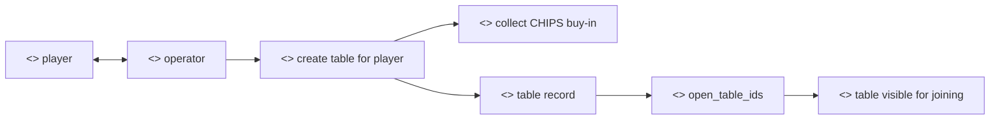

### 4.2 Methods

- `createTable(uint256 lobby_id, uint256 table_id, string name, uint256 buy_in, uint256 num_players, address player_address, bytes annonce_public_key)`

### 4.3 Authorization And Preconditions

The table facet reads the operator for `player_address` from `PrivatePokerAccountsStorage`. The call succeeds only when `msg.sender == operator` or `msg.sender == MainLobby.owner`.

Additional checks:

- `num_players >= 2`;
- lobby exists;
- table id is unused;
- CHIPS token is set;
- player's CHIPS allowance and balance support the buy-in.

### 4.4 Storage Effects

The table is initialized and appended to `Lobby.open_table_ids`. The first `TablePlayer` stores the player address, remaining chips, annonce public key, and operator. The table creator is stored in `Table.created_by`.

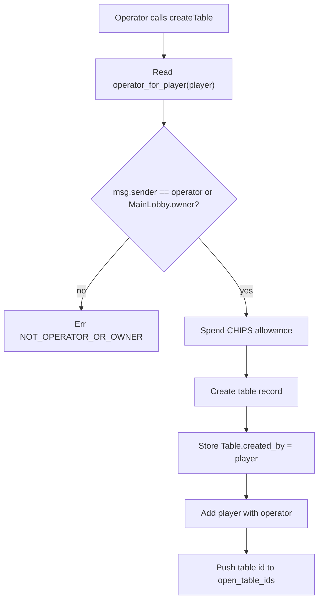

## 5. Join Table

### 5.1 Rationale

Join Table is the operator flow that adds a player to an existing open table. The rationale is to keep joining controlled by account association and to move the table into the correct lifecycle collection as soon as it fills.

We provide the following operations:

- Seating an additional player at a table. The operator must be associated with that player, and the player cannot already be seated.
- Collecting the same buy-in required by the table. This keeps every seat economically consistent.
- Moving a full table from open to running. The lobby list can then distinguish tables still accepting players from tables that have moved into gameplay.
- Recording the player's table id. This supports return-to-table UX and later player history.

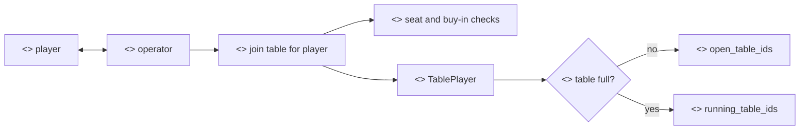

### 5.2 Methods

- `joinTable(uint256 lobby_id, uint256 table_id, address player_address, bytes annonce_public_key)`

### 5.3 Authorization And Preconditions

The caller must be the account operator for `player_address` or `MainLobby.owner`.

The method checks that the lobby and table exist, the table is not full, the player is not already seated, and the CHIPS buy-in can be collected.

### 5.4 Storage Effects

The method appends a new `TablePlayer`, increases table and lobby volume counters, records the table id under `player_tables[player_address]`, and increments total player count.

When the join fills all required seats, the table id is removed from `open_table_ids` by swap-removal and appended to `running_table_ids`.

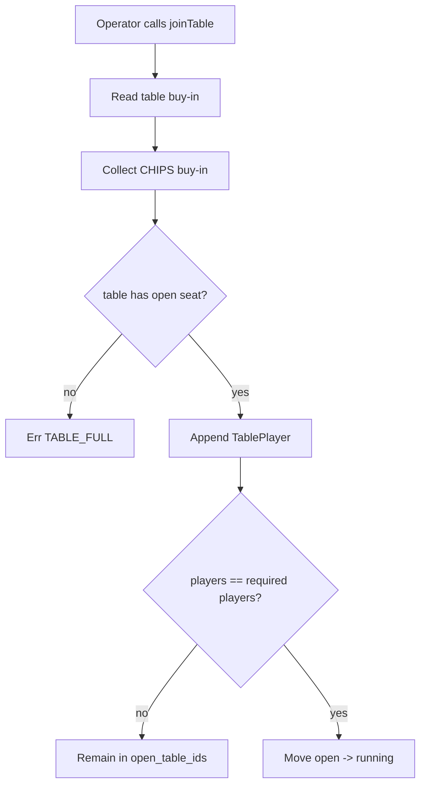

## 6. Start Hand

### 6.1 Rationale

Start Hand is the readiness checkpoint before a hand begins. The rationale is to require each seated participant, through their operator, to confirm that the table is ready for the next on-chain hand id.

We provide the following operations:

- Marking a player ready for the next hand. The operator can only mark readiness for a player seated at the table.
- Counting readiness across all seats. A hand should not advance until every required participant has reached the same checkpoint.
- Advancing the current hand when all players are ready. This gives the peer-to-peer game a shared on-chain marker for the hand being played.

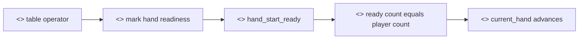

### 6.2 Methods

- `startHand(uint256 lobby_id, uint256 table_id)`

### 6.3 Authorization And Preconditions

The method searches seated players for a `TablePlayer.operator` matching `msg.sender`. `MainLobby.owner` is allowed to act for seat `0`.

Required state:

- lobby and table exist;
- table has players;
- table is full;
- aggregate public key has been set;
- caller has not already marked readiness for the next hand.

### 6.4 Storage Effects

Each ready operator writes `hand_start_ready[player] = current_hand + 1` and increments `hand_start_ready_count`. When all players are ready, the counter resets to zero and `current_hand` advances.

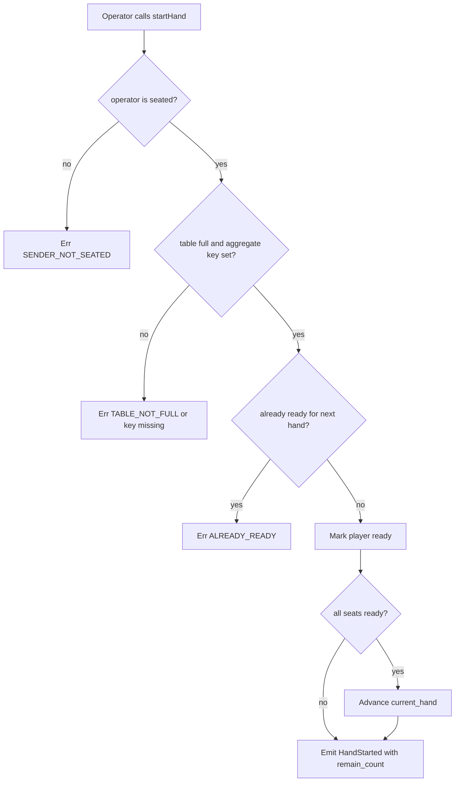

## 7. Aggregate Public Key Submission

### 7.1 Rationale

Aggregate public key submission anchors the table's BLS verification identity before gameplay starts. The rationale is to bind the table to the combined cryptographic identity of the players before cards and settlement evidence depend on it.

We provide the following operations:

- Storing the table aggregate public key before the first hand. This key identifies the BLS group that will later sign verification and settlement messages.
- Requiring signed calldata at the Diamond gate. This proves the aggregate key parameter is itself covered by the submitted signature.
- Rejecting late key changes. Once a hand has started, changing the aggregate key would undermine the meaning of later signatures.

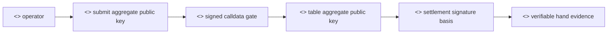

### 7.2 Methods

- `setTableAggregatePublicKey(uint256 lobby_id, uint256 table_id, bytes aggregate_public_key)`

### 7.3 Signature Gate

The diamond requires an appended BLS signature for this selector. The calldata passed by the client is the normal ABI-encoded call followed by the raw 48-byte signature. The diamond calls `Signatory.verifySignedCalldata`, strips the signature, and then delegates the original call to the aggregate public key facet.

The signatory:

- splits `actual_calldata = calldata[0..k]` and `signature = calldata[k..]`;
- extracts the aggregate public key from the ABI-encoded calldata by raw byte offsets;
- calls the hash-to-curve contract on `actual_calldata`;
- calls the verify-signature contract with hashed message, aggregate public key, and signature.

### 7.4 Authorization And Storage Effects

After signature verification, the aggregate public key facet checks that `msg.sender` is `MainLobby.owner` or one of the table operators. It rejects updates after `current_hand != 0`.

On success, it writes `Table.aggregate_public_key` and emits `TableAggregatePublicKeySet`.

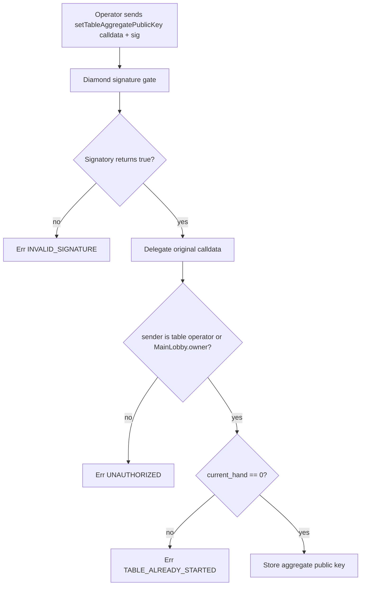

## 8. Settle Hand

### 8.1 Rationale

Settle Hand is the final authority for table balances after a hand. The rationale is to turn peer-to-peer gameplay evidence into a deterministic on-chain balance update and, when the table is complete, a winner payout.

We provide the following operations:

- Storing the settled hand result. The hand digest, pot size, and pot split become the on-chain record of the verified result.
- Updating each player's remaining table chips. This keeps table state aligned with the submitted final balance vector.
- Paying the final table winner when only one player remains with chips. This moves CHIPS out of table escrow and back to the winning player.
- Moving a completed table out of active lobby listing. Completed tables enter a separate collection so players are not offered stale tables as joinable.
- Returning either the winning seat index or a sentinel. Seats are zero-based; when the table continues, the sentinel is the number of players.

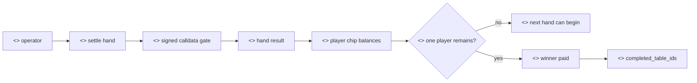

### 8.2 Methods

- `settleHand(uint256 lobby_id, uint256 table_id, uint256 hand_id, uint256 pot_size, uint256[] pot_split, uint256[] chips_balances, bytes digest, bytes aggregate_public_key) returns (uint256)`

### 8.3 Authorization And Signature Gate

`settleHand` also requires diamond-level signed calldata. After signature verification, the settler facet checks `msg.sender == MainLobby.owner` or that `msg.sender` is one of the table operators.

### 8.4 Preconditions

The settler requires:

- non-zero hand id;
- digest length matches the configured digest length;
- aggregate public key length is 96 bytes;
- lobby and table exist;
- `table.current_hand == hand_id`;
- table is full;
- `pot_split.len() == num_players`;
- `chips_balances.len() == num_players`;
- sum of `pot_split` equals `pot_size`;
- sum of `chips_balances` equals `table.total_buyin`;
- supplied aggregate public key matches the stored table aggregate public key;
- hand has not already been settled.

### 8.5 Storage Effects And Completion

For every settlement, the hand stores pot size, pot split, and digest. Player chip balances are updated from `chips_balances`.

If exactly one player has a non-zero chip balance, the table is complete. In that case:

- all table player `chips_remain` values are set to zero;
- the winner receives the winning CHIPS balance from diamond escrow;
- `table.total_buyin` is set to zero;
- the table id is moved to `completed_table_ids`;
- active lobby listing stops returning the table.

The return value is the winning seat index when the table is complete. Seats are zero-based. If the table is not complete, the method returns the sentinel value `num_players`.

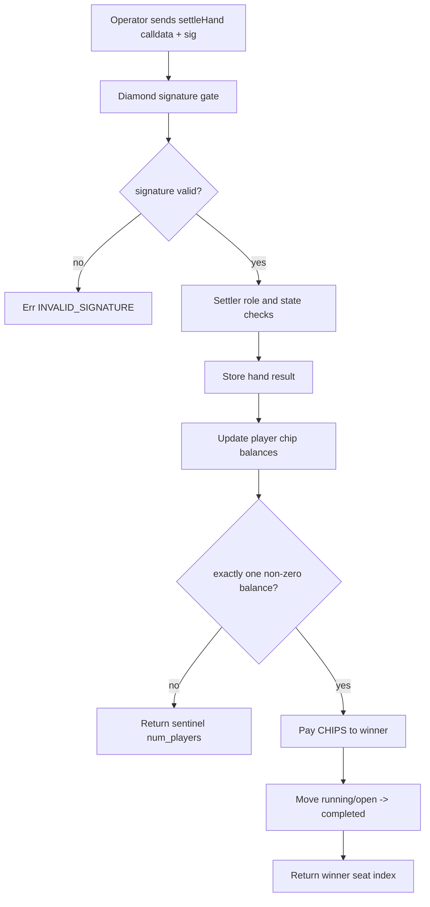

## 9. Expected Outcomes

Successful operator flows produce:

- open tables after creation;
- running tables after the final required player joins;
- hand readiness and hand advancement after all operators call `startHand`;
- aggregate public key storage before gameplay starts;
- settled hand records;
- completed table transition and winner payout when only one player remains.

## 10. Failure States

Common expected failures:

- `ACCOUNT_MISSING` when the player has no account or no operator;
- `NOT_OPERATOR_OR_OWNER` when a non-operator attempts table creation or join;
- `UNAUTHORIZED` when aggregate key or settlement is called by an address that is not a table operator or owner;
- `INVALID_SIGNATURE` when diamond-level signature verification fails;
- `TABLE_ALREADY_STARTED` when aggregate key is set after the first hand starts;
- `HAND_NOT_CURRENT` or `HAND_ALREADY_SETTLED` during settlement;
- `INVALID_POT_SPLIT`, `INVALID_CHIPS_BALANCES`, or length errors for inconsistent settlement input;
- `CHIP_PAYOUT_FAILED` when escrow has insufficient CHIPS for a completed table payout.

## 11. Security Considerations

The diamond signature gate protects aggregate public key submission and hand settlement before delegated execution. The facet-level operator checks still run after the signature gate.

The aggregate public key parameter remains an ABI parameter of the target function. The appended signature is not ABI encoded as an argument; it is raw bytes cut from the end of calldata by fixed length.

`Table.has_operator` scans stored table players. A valid account operator can only affect a table after that operator has been stored into the table during create or join.

Completed tables are removed from active listing by moving the id to `completed_table_ids`. The removal operation can reorder the open or running table id collections.

## 12. Implementation Reference

- `contracts/table/src/privatepoker_table.rs`
- `contracts/hand/src/privatepoker_hand.rs`
- `contracts/aggregate_pub_key/src/privatepoker_aggregate_pub_key.rs`
- `contracts/settler/src/privatepoker_settler.rs`
- `contracts/diamond/src/privatepoker_diamond.rs`
- `contracts/signatory/src/privatepoker_signatory.rs`
- `contracts/hash_to_curve/src/privatepoker_hash_to_curve.rs`
- `contracts/verify_signature/src/privatepoker_verify_signature.rs`
- `common/src/model/accounts.rs`
- `common/src/model/lobby.rs`
- `common/src/model/table.rs`
