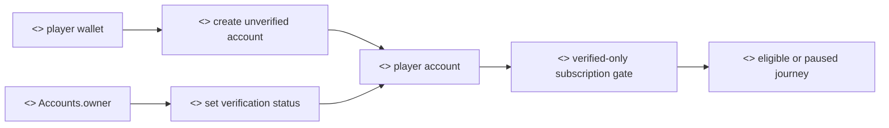
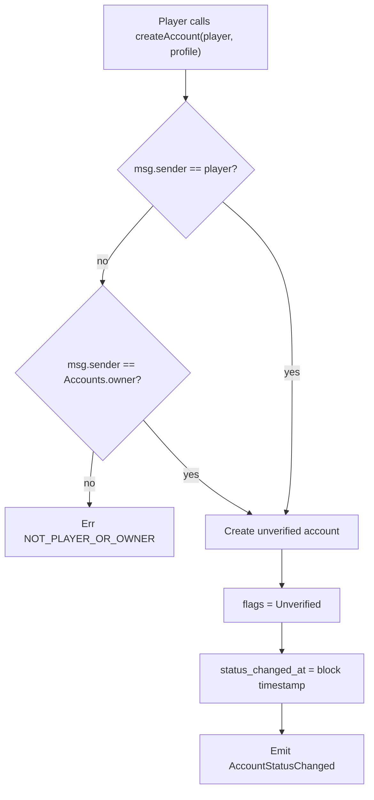
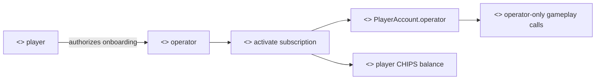
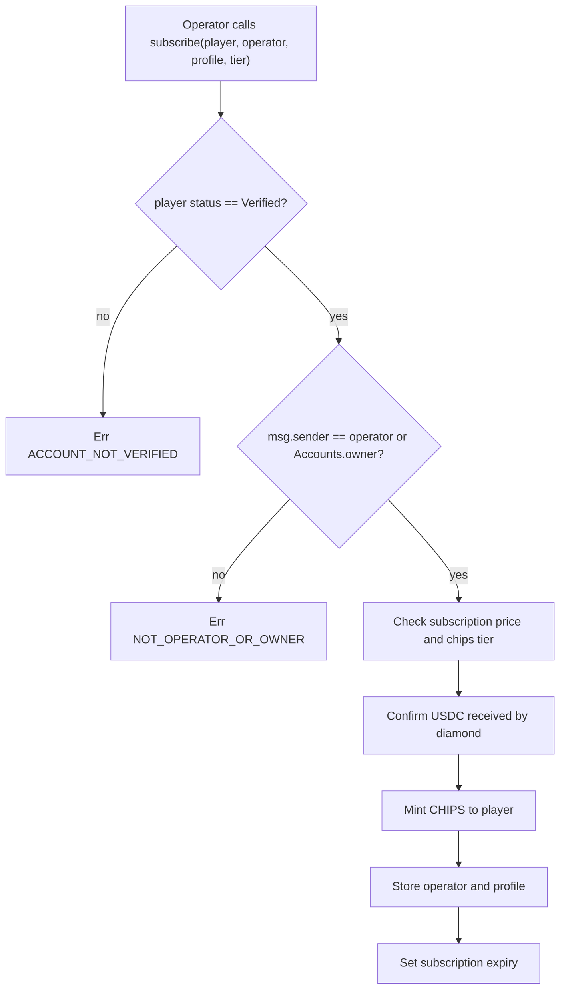
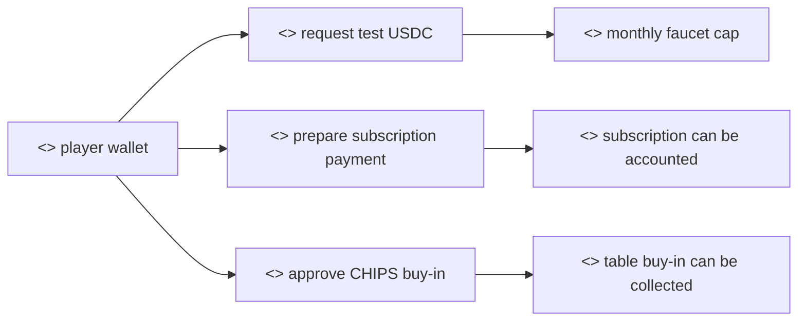
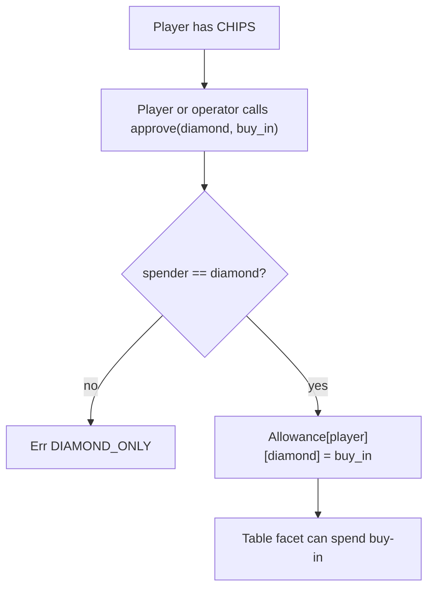
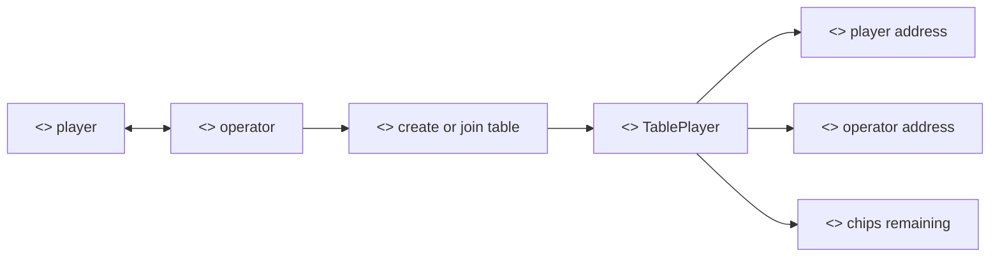
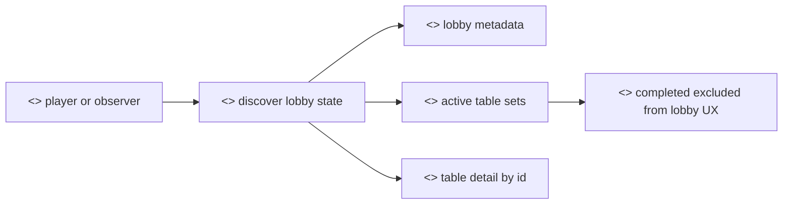
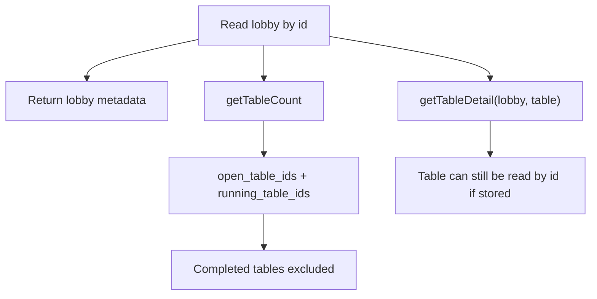

# Player Security Flows

## 1. Purpose

This document describes smart-contract flows initiated by a player wallet. A player is the wallet address that owns a poker account and receives CHIPS balances. The player is distinct from the operator address associated with the account. The operator is expected to perform most gameplay calls after subscription.

Player flows cover account creation, account status reads, USDC approval or transfer preparation, CHIPS approval, table membership as the stored player address, and read-only lobby/table discovery.

### 1.1 Engagement Goal

For an Innovation Hub discussion, the player security case should show how a wallet holder becomes eligible to participate, where value movement begins, and where the product can insert KYC, consumer-protection, responsible-gaming, and financial-crime controls. The goal is to discuss the regulatory perimeter around account creation, subscription, token funding, buy-ins, payouts, and withdrawal design before live users are exposed.

### 1.2 Why This Security Case Matters

The player is the consumer-facing identity. Player protections must be understandable without reading smart-contract code: a player should know when they are only signing in, when they are creating an unverified account, when they are approving tokens, and when chips are committed to a table. Separating player identity from operator execution is intended to reduce wallet-prompt fatigue while preserving a clear player account and payout destination.

## 2. Actors And Prerequisites

| Actor | Meaning |
| --- | --- |
| Player | Wallet address represented by `PlayerAccount.player_address` |
| Operator | Address associated to the player during subscription |
| Main lobby owner | Protocol owner with recovery/admin permission |
| Diamond | Canonical contract address used for delegated protocol calls |
| Test USDC faucet caller | Development-only funding identity |

Prerequisites for a player to enter gameplay:

- an account exists with non-zero `flags`;
- account status is `Verified`;
- subscription is active;
- an operator has been associated through `subscribe`;
- the player has CHIPS and has approved the diamond for table buy-in movement.

## 3. Account Creation And Verification State

### 3.1 Rationale

Account creation lets the player establish a protocol identity without immediately receiving gameplay permission. The rationale is to separate wallet control from eligibility, so the system can recognise a player before allowing that player to subscribe, buy in, or join the main lobby.

We provide the following operations:

- Creating an unverified player account. This creates a durable on-chain record for the wallet without granting gameplay access.
- Reading account status and the last status-change time. This lets the frontend explain whether the player is unverified, verified, suspended, banned, deleted, or missing.
- Reading account profile and subscription status. This lets the frontend choose the correct next screen without exposing subscription options to a player who is not verified.

### 3.2 Methods

- `createAccount(address player_address, string display_name, bytes encrypted_profile)`
- `getAccountStatus(address player_address)`
- `accountStatusChangedAt(address player_address)`
- `getAccount(address player_address)`
- `isSubscriptionActive(address player_address)`

### 3.3 Authorization

`createAccount` accepts a player self-call where `msg.sender == player_address`. It also accepts the account owner for administrative creation.

Creating an account sets `flags = Unverified`. The player cannot subscribe until the owner changes status to `Verified`.

### 3.4 Storage Effects

`PlayerAccount.flags`, `status_changed_at`, and `player_address` are written on account creation. The player address is appended to `PrivatePokerAccountsStorage.players`.

No operator is associated at account creation.

## 4. Subscription And Operator Association

### 4.1 Rationale

Subscription is the point where a verified player becomes economically active and an operator is associated with the account. The rationale is to make the player-to-operator relationship explicit, paid for, and dependent on verified status.

We provide the following operations:

- Activating a subscription tier for a verified player. This defines the subscription period and the CHIPS credited to the player.
- Associating one operator with the player. This operator can later perform gameplay operations, but the association is created only here.
- Storing announce public key and encrypted profile data. This supports peer discovery and profile display without making operator assignment a loose table-level parameter.
- Minting CHIPS after subscription accounting confirms that payment has reached the protocol.

### 4.2 Methods

- `subscribe(address player_address, address operator, string display_name, bytes annonce_public_key, bytes encrypted_profile, uint8 subscription_tier)`

Although this call modifies the player's account, the current authorization expects the caller to be the proposed operator or the accounts owner. The operation is the only contract flow that associates an operator with a player.

### 4.3 Preconditions

- `player_address != address(0)`;
- `operator != address(0)`;
- `msg.sender == operator` or `msg.sender == PrivatePokerAccountsStorage.owner`;
- player account status is exactly `Verified`;
- subscription tier is one of Starter, Regular, or Professional;
- USDC for the subscription has already reached the diamond address before `deposit_subscription` accounting completes.

### 4.4 Storage Effects

On success:

- account `operator` is written;
- previous operator mapping is removed if needed;
- `operator_players[operator] = player_address`;
- `annonce_public_key` and `encrypted_profile` are stored;
- subscription tier, paid timestamp, and expiry timestamp are stored;
- cashier accounted assets increase;
- CHIPS are minted to the player.

## 5. Funding And Token Approvals

### 5.1 Rationale

Funding and approvals define when a player authorizes value movement. The rationale is to keep test funding, subscription payment, and table buy-in approvals separate, so a player and an auditor can tell which action moved value and why.

We provide the following operations:

- Receiving limited test USDC from the development faucet. This is a local-testing convenience and should not be confused with production funding.
- Reading faucet refill timing and remaining allowance. This makes the test faucet predictable and prevents unlimited test funding from a single account in one refill period.
- Approving or transferring USDC for subscription. This is the payment-side preparation for subscription accounting.
- Approving CHIPS to the Diamond for table buy-ins. CHIPS are soul-bound in ordinary use, so approvals are tied to the protocol path that collects table buy-ins.

### 5.2 Methods

- `faucet(address to, uint256 value)`
- `faucet_next_refill(address account)`
- `faucet_remaining_amount(address account)`
- `approve(address spender, uint256 value)`

### 5.3 Test USDC Faucet

`TestUsdc::faucet(address to, uint256 value)` uses `msg.sender` as the faucet account and `to` as the beneficiary. A faucet account receives up to `$100` per refill period. The refill period is 30 days.

`faucet_next_refill(address account)` and `faucet_remaining_amount(address account)` expose the faucet state for the caller or any account.

### 5.4 USDC And CHIPS Approvals

The player approves USDC or transfers USDC according to the frontend flow before subscription accounting. CHIPS approval is required before table buy-ins because table creation and joining spend the player's CHIPS allowance.

`Chips::approve(address spender, uint256 value)` requires `spender == diamond`. If called by an operator, the approval is recorded against the mapped player returned by `operator_players`.

## 6. Table Membership

### 6.1 Rationale

Table membership records which player addresses are seated and which operators may act for them. The rationale is to preserve the player as the economic identity while allowing the operator to perform gameplay calls.

We provide the following operations:

- Seating the table creator as the first player. The table records the creator as `created_by` and stores that player's operator.
- Seating additional players through their own operators. Each player keeps a distinct player address, CHIPS balance, announce public key, and operator entry.
- Keeping player and operator separate in table storage. Payouts, disputes, account restrictions, and historical records attach to the player, while fast gameplay execution uses the operator.

### 6.2 Methods

- `createTable(uint256 lobby_id, uint256 table_id, string name, uint256 buy_in, uint256 num_players, address player_address, bytes annonce_public_key)`
- `joinTable(uint256 lobby_id, uint256 table_id, address player_address, bytes annonce_public_key)`

### 6.3 Stored Membership Model

Players are stored as `TablePlayer.address` entries. `createTable` and `joinTable` receive `player_address`, but the call must come from that player's associated operator or from `MainLobby.owner`.

The table record stores:

- `created_by` as the player who created the table;
- `players[index].address` as the player address;
- `players[index].operator` as the operator read from account storage;
- `players[index].chips_remain` as the buy-in balance;
- `players[index].annonce_public_key` for networking.

Players do not directly satisfy the gameplay authorization checks unless the player address is also the stored operator.

## 7. Read-Only Discovery

### 7.1 Rationale

Read-only discovery gives players and public observers a consistent view of lobby, table, and account state. The rationale is to separate current player actions from historical records: open and running tables should be easy to find, while completed tables should not appear as joinable opportunities.

We provide the following operations:

- Listing lobbies and lobby details. This exposes the current catalogue of poker environments.
- Listing active tables in a lobby. This reads open and running table ids while excluding completed tables.
- Reading table detail by id. This keeps direct table inspection possible for seated players, support, and future history views.
- Reading a player's table ids and account state. This supports return-to-table UX and account gating.

### 7.2 Methods

- `getLobbyCount()`, `getLobbyAt(uint256 index)`, `getLobbyById(uint256 lobby_id)`
- `getTableCount(uint256 lobby_id)`, `getTablesRange(uint256 lobby_id, uint256 offset, uint256 count)`, `getTableDetail(uint256 lobby_id, uint256 table_id)`
- `getPlayerTables(address player)`
- `getAccountStatus(address player_address)`, `isSubscriptionActive(address player_address)`

### 7.3 Available Reads

Read-only methods available to players and public consumers:

- lobby count and lobby detail;
- active table count and active table ranges;
- table detail by id;
- player table ids;
- account status and subscription status.

Active table listing reads `open_table_ids` and `running_table_ids`. Completed tables are not returned by active listing.

## 8. Expected Outcomes

A successful player-facing onboarding path produces:

- an unverified account after player self-creation;
- a verified account after owner approval;
- a subscribed account after operator-associated subscription;
- CHIPS balance minted to the player;
- CHIPS allowance to the diamond for buy-ins;
- table player entries storing the player and operator separately.

## 9. Failure States

Common expected failures:

- `NOT_PLAYER_OR_OWNER` when an unrelated address attempts account creation;
- `ACCOUNT_NOT_VERIFIED` when subscription is attempted before verification;
- `BAD_TIER` for unsupported subscription tiers;
- `USDC_NOT_RECEIVED` when subscription accounting cannot observe the required USDC at the diamond;
- `DIAMOND_ONLY` when CHIPS approval, mint, burn, or restricted calls target the wrong spender/caller;
- `CHIPS_NON_TRANSFERABLE` when a player attempts an unsupported CHIPS transfer;
- `TABLE_NOT_FULL`, `TABLE_FULL`, or `ALREADY_SEATED` around table membership and hand start.

## 10. Security Considerations

The player and operator are deliberately separate. The account storage mapping `operator_players` is the canonical link used by CHIPS to treat an operator call as a player operation.

`subscribe` is the only flow that writes the player-to-operator association. Table creation and joining read the operator from account storage and persist it into `TablePlayer.operator`.

Completed table ids are moved out of active table listing. A player's historical table id list is append-only in the current flow and may include tables that no longer appear in lobby active lists.

## 11. Implementation Reference

- `contracts/account/src/account.rs`
- `contracts/table/src/privatepoker_table.rs`
- `contracts/chips/src/chips.rs`
- `contracts/test_usdc/src/test_usdc.rs`
- `contracts/spectate/src/privatepoker_spectate.rs`
- `common/src/model/accounts.rs`
- `common/src/model/table.rs`
- `common/src/model/lobby.rs`
